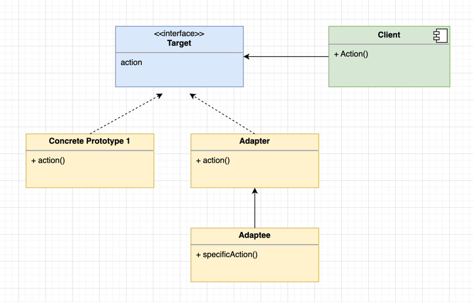

### 在适配器模式中，有三个主要角色：

1. 目标接口（Target）: 定义客户端使用的接口，是客户端期望的接口。
2. 适配器（Adapter）: 实现目标接口并包含被适配者的实例，将被适配者的接口转换为目标接口。
3. 被适配者（Adaptee）: 需要被适配的接口。

### 适配器模式常用于以下情况：

1. 系统需要使用已经存在的类，而其接口不符合系统的需求。
2. 想要创建一个可复用的类，该类可以与其他不相关的类或不可预见的类协同工作。
3. 希望通过接口转换重用已经存在的类。

### uml

