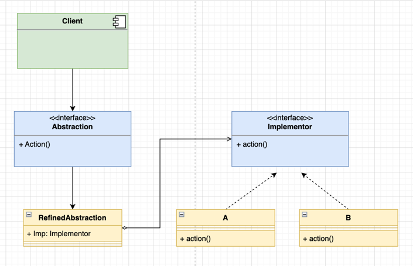

桥接设计模式是一种结构型设计模式，其目的是将抽象部分与实现部分分离，
使它们可以独立地变化。这样，系统的抽象部分和实现部分可以分别扩展，而
不会相互影响。桥接模式通过组合而不是继承来实现这种分离。

在桥接模式中，抽象部分包含一个指向实现部分的引用，而实现部分则提供了
一个接口供抽象部分调用。这种分离使得可以在运行时动态地选择实现，而不是
在编译时固定。

以下是桥接设计模式的一些关键角色：

1. 抽象部分（Abstraction）： 定义系统中的高层次结构，维护一个指向实现部分的引用。
2. 实现部分（Implementor）： 定义实现部分的接口，供抽象部分调用。
3. 具体抽象部分（Refined Abstraction）： 扩展抽象部分，可以引用多个实现部分。
4. 具体实现部分（Concrete Implementor）： 实现实现部分的接口。

### 桥接模式常用于以下情况：
1. 当一个类存在两个独立变化的维度，且这两个维度都需要进行扩展。
2. 当希望避免使用静态继承，因为它将导致大量的子类产生。
3. 当一个类需要引用多个实现或者一个实现的变化不应影响到客户端。

### uml

